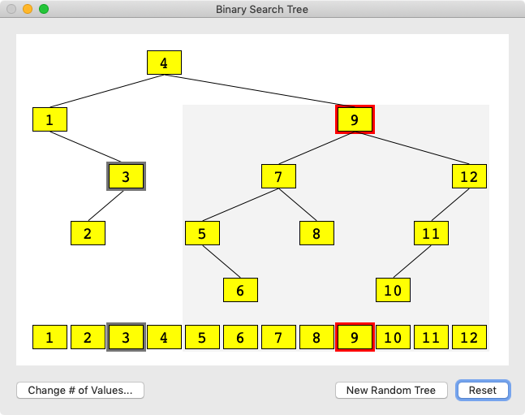

#  BSTDemo

My goal in writing this app was to get a better feel for binary search trees (BSTs), both by writing the app and by using it.  For me, it's "self-educational" software.  If it helps you, then it will have been plain old "educational" software.

This app displays a sorted array of values at the bottom of the window.  You can construct a BST using these values by clicking on them one by one in the sorted array.  Alternatively, you can click a button and generate a random tree containing all the values.

The nodes of the tree are laid out in a specific way.  Each node in the tree is directly above the corresponding value in the array.  One thing you can see from this layout is that any subtree of a BST corresponds to a contiguous subarray of the sorted array.  This becomes clear when you click on any node in the tree.

